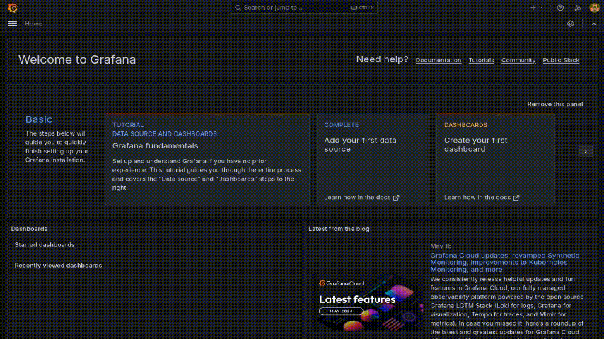
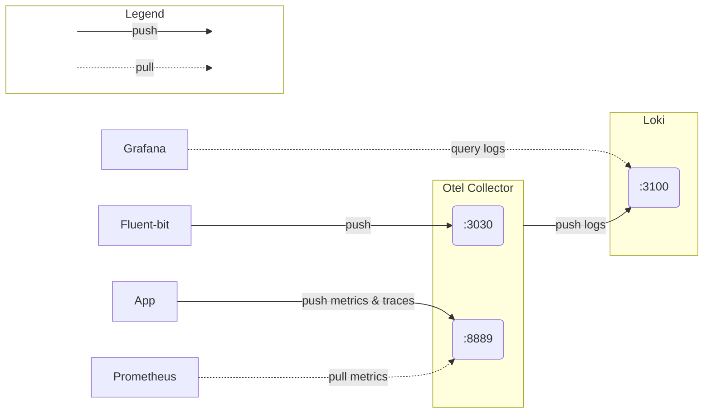

# kbot-flux-otel-monitoring-2



## Installation
```sh
terraform apply -var-file=<your-var-file>
```

#### Terraform Input Variables

| Name    | Description |
| -------- | ------- |
| github_org  | Власник репозиторію на GitHub (наприклад, `yevgen-grytsay`)    |
| github_repository | Назва репозиторію на GitHub (без назви власника, наприклад `kbot-flux-otel-monitoring-2`)     |
| github_token    | GitHub PAT-токен для flux     |

## Якщо треба повторити шифрування секрету
Завантажити сертифікат, згенерований `sealed-secrets-controller`:
```sh
$ kubeseal --fetch-cert --controller-name=sealed-secrets-controller --controller-namespace=flux-system > pub-sealed-secrets.pem
```
Якщо команда не спрацьовує, наприклад повертає помилку `error: cannot fetch certificate: error trying to reach service: dial tcp 10.1.182.226:8080: i/o timeout`, можна зробити те ж саме наступним способом:

```sh
kubectl get secret \
  --namespace flux-system \
  --selector sealedsecrets.bitnami.com/sealed-secrets-key=active \
  --output jsonpath='{.items[0].data.tls\.crt}' \
| base64 -d > ./pub-sealed-secrets.pem
```

Тепер можна згенерувати і зашифрувати серкет:
```sh
read -s TELE_TOKEN
export TELE_TOKEN

kubectl -n default create secret generic kbot-token-secret \
--namespace=kbot \
--from-literal=token=${TELE_TOKEN} \
--dry-run=client \
-o yaml > ./secret.yaml

kubeseal --format=yaml --cert=pub-sealed-secrets.pem \
< ./secret.yaml > ./cluster/kbot/secret-sealed.yaml

rm ./secret.yaml
rm ./pub-sealed-secrets.pem

git add ./cluster/kbot/secret-sealed.yaml
```

## Схема моніторингу



## Debug
```sh
kubectl run curl --image=radial/busyboxplus:curl -i --tty --rm
```

### Loki
```sh
kubectl port-forward -n kbot svc/loki-gateway 3100:80

export LOKI_ADDR=http://127.0.0.1:3100

logcli labels

logcli query '{exporter="OTLP"}'
```

### Grafana
```sh
# Get admin password
kubectl get secret -n kbot grafana -o jsonpath="{.data.admin-password}" | base64 --decode ; echo

# Port-forwarding
export POD_NAME=$(kubectl get pods -n kbot -l "app.kubernetes.io/name=grafana,app.kubernetes.io/instance=grafana" -o jsonpath="{.items[0].metadata.name}")
kubectl -n kbot port-forward $POD_NAME 3000
```

### Prometheus
```sh
export POD_NAME=$(kubectl get pods --namespace kbot -l "app.kubernetes.io/name=prometheus,app.kubernetes.io/instance=prometheus" -o jsonpath="{.items[0].metadata.name}")

kubectl --namespace kbot port-forward $POD_NAME 9090
```

## Resources
### Fluent-bit
- [Filters | Kubernetes](https://docs.fluentbit.io/manual/pipeline/filters/kubernetes)
- [Helm values.yaml](https://raw.githubusercontent.com/fluent/helm-charts/main/charts/fluent-bit/values.yaml)
- [Inputs | Tail](https://docs.fluentbit.io/manual/pipeline/inputs/tail)
- [Outputs | OpenTelemetry](https://docs.fluentbit.io/manual/pipeline/outputs/opentelemetry)

### OpenTelemetry Collector
- [Helm values.yaml](https://github.com/open-telemetry/opentelemetry-helm-charts/blob/main/charts/opentelemetry-collector/values.yaml)
- [Recommended Processors](https://github.com/open-telemetry/opentelemetry-collector/tree/main/processor#recommended-processors)
  - [Batch Processor](https://github.com/open-telemetry/opentelemetry-collector/blob/main/processor/batchprocessor/README.md)

### Grafana Loki
- [Loki overview](https://grafana.com/docs/loki/latest/get-started/overview/)
- [Helm values.yaml](https://github.com/grafana/loki/blob/main/production/helm/loki/single-binary-values.yaml)

### Grafana
- [Helm values.yaml](https://github.com/grafana/helm-charts/blob/main/charts/grafana/values.yaml)
